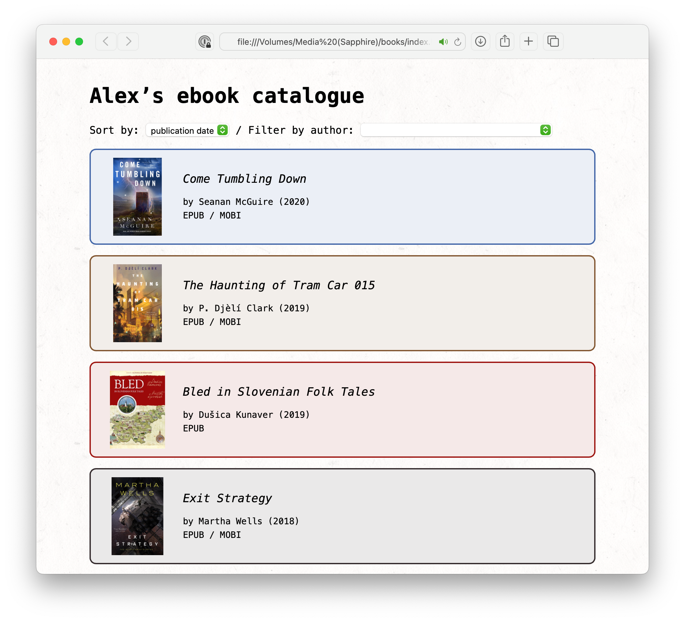

# catalogue

This is a tiny script for managing my ebook collection.
When I run the `save_book.py` script, it:

*   Asks me a few questions about the book (title, author, publication date)
*   Moves the file into the same folder as my other ebooks, with consistent naming
*   Adds the metadata to a `metadata.json` file

Here's what the folder with my ebooks in looks like:

If I open the top-level HTML file, I get a basic web app that gives me a way to list my books with metadata.
It also has some basic filtering options:

If I click a book in the web app, it shows me the appropriate file in the macOS Finder.
